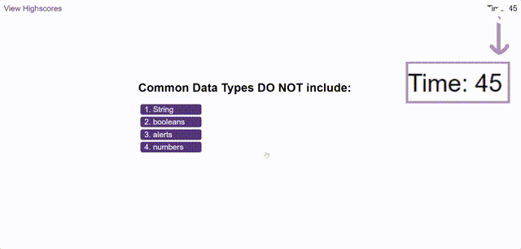

# Module 6 Challenge: Code Quiz

  

</br>

## Table of Contents
* [Description](#description)
* [Features](#features)
* [Installation & Deployment](#installation-and-deployment)
* [How to Use](#how-to-use)
* [License](#license)

</br>


## Description

This challenge presents a real-world situation in which the newfound JavaScript skills will come in handy. The code has been built to enable people to take a timed digital quiz with a customized grading rule-set. In this application, the test consits of three coding-related questions that should be answered in 45 secs while any incorrect answers will penalize the user's time/score by 10 secs. The results will be stored and shown after sorting them from the highest score. The application can be run in the browser and has been designed to adapt to multiple screen sizes.

</br>


</br>

## Features

This application works by clicking the `start quiz` button and choosing any answers. The test's results are the remaining time the users have left that are also their grades. There are rules that have been set that affect the result. These results are stored into a local storage and sorted before being shown on highscore board. Sound effects have been added to make the quiz more attractive. Furthermore, the application User Interface (UI) also has been designed to be responsive so it can work in various screen sizes.

</br>

### Clean and Responsive UI
This application offers a responsive User Interface (UI) that adapts to multiple screen sizes which can be seen on following gif.


</br>

### Exam and Grading Systems

Once the `start quiz` button is clicked, the first questions appears. The next question appears after the user answers the current question. The list of questions is defined in the `questions.js` file by following the syntax format as below.

  ```javascript
  let questions = [
      {
          "title": "question 1",
          "choices": ["choice 1", "choice 2", "choice 3", "choice 4"],
          "answer": "choice 1"
      },
      {
          "title": "question 2",
          "choices": ["choice 1", "choice 2", "choice 3", "choice 4"],
          "answer": "choice 2"
      }
  ]
  ```

</br>

In this quiz application, the users' grades are the remaining time that the users have left after finishing the quiz. Hence, users should finish the quiz as quick as possible. However, any incorrect questions leads to 10 secs of time deduction.



</br>

### Text and Sound Effects
Any time users choose the answers. There is a text and a sound effect (sfx) depends on whether it is a correct or an incorrect answer by including.

https://user-images.githubusercontent.com/45983587/214398923-49ab2f9e-ba6f-44a6-a179-e2a324411a5e.mp4


</br>

### Local Storage and Highscore Board

After finishing the quiz, users can input their name. Those names alongside with the results are stored in the `highscores` local storage and sorted before showing them onto the highscore board. Once the users input their name, the highscore board appears. Another way to access this board is by clicking `View Highscore` on the top left corner of main page.


</br>


</br>

</br>

## Installation and Deployment

Installation not required, since this is a "plug and play" type of application. The user can simply run it locally by clicking on the `index.html` file and opening in either their default or preferred browser.

Application can also be accessed at following links:
* [GitHub repository](https://github.com/YueHuaHua/module-06-challenge).
* [Deployed application](https://yuehuahua.github.io/module-06-challenge/).

</br>

## How to Use 

* Click the `Start Quiz` purple button to start the quiz
* Click any choices that you think it's correct
* Try to answer all questions in 45 secs
* Any wrong answers will deduct your time/score by 10 secs
* Input your initial name once you are done and click `Submit`
* Click `Clear Highscores` button if you wish to reset the highscore board
* The highscore board can be accessed without doing the exam by clicking `View Highscores` on the top left main page

</br>

## License

Licensed under the [MIT license](https://github.com/git/git-scm.com/blob/main/MIT-LICENSE.txt). See LICENSE for the full details.
